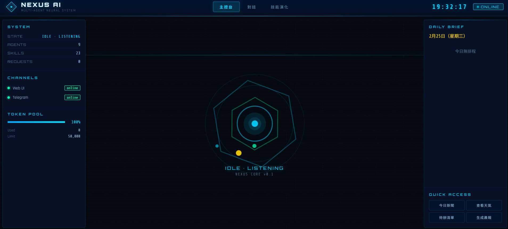
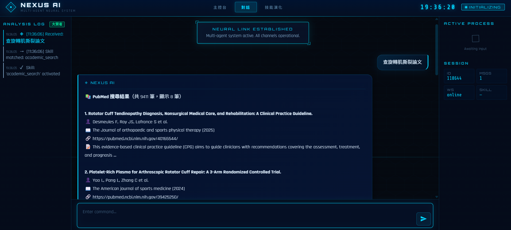
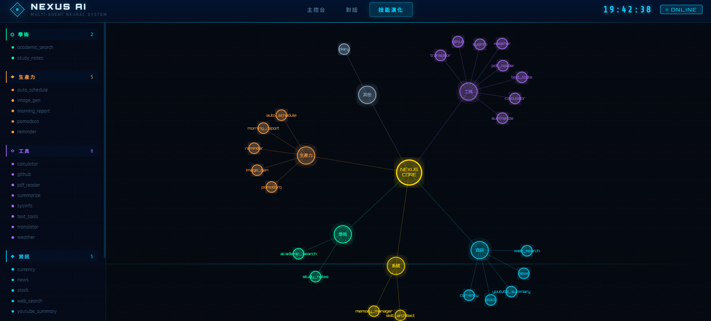

<div align="center">

# ◈ NEXUS AI

### Multi-Agent Personal Intelligence System

*Nine specialist agents. Twenty-two skills. One physical therapy student's daily driver.*

[](https://python.org)
[](https://fastapi.tiangolo.com)
[](https://ai.google.dev)
[](https://azure.microsoft.com)
[](LICENSE)
[](https://github.com/xushuowen/nexus-ai)

</div>

---

## 🎬 Demo Video

> ▶ **[Watch 2-Minute Demo](https://youtu.be/TODO)** — ACL paper search · Clinical notes · Telegram vision · Architecture overview

---

## The Problem

I'm a physical therapy student. Every day I need to:
- Find **peer-reviewed papers** on clinical topics (MeSH-quality search, not Google)
- Organize notes **by PT subject** (anatomy, orthopedics, neurology…)
- Get answers about **clinical anatomy diagrams** from my textbooks
- **Schedule reminders** that actually fire, even when I'm away from my desk

No single AI tool does all of this. So I built one that does.

---

## Screenshots

<table>
<tr>
<td align="center" width="50%">

**主控台 (Dashboard)**

*Live agent status · token budget · daily schedule*

</td>
<td align="center" width="50%">

**對話 (Integrated Chat)**

*Analysis log · chat · active agent — all in one tab*

</td>
</tr>
<tr>
<td align="center" width="50%">

**技能演化圖 (D3.js Skill Graph)**

*Force-directed graph of all 22 skills and 9 agents*

</td>
<td align="center" width="50%">

**Telegram Bot**

*Vision agent · anatomy Q&A · scheduling*

</td>
</tr>
</table>

> 📸 **Screenshot guide:** Start server → navigate to each tab → capture `1920×1080`
> Save files to `docs/screenshots/` with the filenames above.

---

## System Architecture

```
┌─────────────────────────────────────────────────────────────┐
│                      INTERFACES                              │
│   Web UI (WebSocket)  ·  Telegram Bot  ·  REST API          │
└────────────────────────────┬────────────────────────────────┘
                             │
┌────────────────────────────▼────────────────────────────────┐
│                TOKEN BUDGET CONTROLLER                       │
│        50,000 tokens/day hard cap · auto-reset at midnight  │
└────────────────────────────┬────────────────────────────────┘
                             │
┌────────────────────────────▼────────────────────────────────┐
│                      ORCHESTRATOR                            │
│   Intent detection → Agent scoring → Memory recall → Route  │
└──────────────┬──────────────────────────────┬──────────────┘
               │                              │
┌──────────────▼──────────────┐  ┌────────────▼──────────────┐
│     SPECIALIST AGENTS (9)   │  │    SKILL ENGINE (22)       │
│                             │  │                            │
│  Reasoning   · chain-of-   │  │  academic_search  weather  │
│               thought COT   │  │  translator       news     │
│  Research    · web + synth  │  │  calculator       stock    │
│  Vision      · image/OCR    │  │  currency         github   │
│  Coder       · code gen     │  │  reminder         diary    │
│  Knowledge   · fact recall  │  │  auto_schedule    pomodoro │
│  File        · local files  │  │  study_notes      pdf_read │
│  Web         · URL fetch    │  │  youtube_summary  text_tool│
│  Shell       · sandbox exec │  │  web_search       memory   │
│  Optimizer   · self-optim.  │  │  skill_architect  + more   │
└─────────────────────────────┘  └────────────────────────────┘
               │
┌──────────────▼──────────────────────────────────────────────┐
│                  4-LAYER MEMORY SYSTEM                       │
│                                                              │
│  ① Working Memory    7 attention slots, LRU eviction        │
│  ② Episodic Memory   SQLite FTS5, full-text search          │
│  ③ Semantic Memory   ChromaDB + sentence-transformers        │
│  ④ Procedural Cache  response dedup, 1hr TTL                │
└──────────────┬──────────────────────────────────────────────┘
               │
┌──────────────▼──────────────────────────────────────────────┐
│            LLM PROVIDER                                      │
│  Primary : Gemini 2.0 Flash  (Google GenAI SDK)             │
│  Fallback: Groq Llama 3.3 70B                               │
└─────────────────────────────────────────────────────────────┘
```

---

## Key Features

### 🧠 Multi-Agent Orchestration
Every request is scored against all 9 agents simultaneously. The highest-confidence agent handles it — no manual selection, no keyword commands.

```python
# Example: "幫我找前十字韌帶復健的相關論文"
# Orchestrator automatically routes to academic_search skill
# which expands "前十字韌帶" → "Anterior Cruciate Ligament[MeSH]"
# and queries PubMed's E-utilities API directly
```

### 🔬 PT-Domain Academic Search
Three real databases — **PubMed** (NCBI E-utilities), **Semantic Scholar**, **OpenAlex** — with automatic MeSH term expansion for physical therapy vocabulary. Returns real PMIDs, authors, journals, and direct links.

### 📝 Persistent Study Notes System
Notes organized by PT subject category (解剖學, 骨科, 神經, 心肺…). Stored in SQLite, searchable by keyword, reviewable by subject. LLM-powered quiz generation from saved notes.

### 👁️ Multimodal Vision
Send any image via Telegram → Vision agent analyzes with Gemini's multimodal API. Clinical anatomy diagrams, X-rays, textbook figures — described in Traditional Chinese.

### 📅 Autonomous Scheduler
Set recurring tasks in natural language:
- `「每天早上6點 生成晨報」` — daily at 6AM
- `「每週一三五早上7點 英文單字練習」` — Mon/Wed/Fri
Executes automatically and sends Telegram notifications.

### 💡 Three-Layer NLP Routing
1. **Trigger keywords** — instant match, no LLM needed
2. **Intent patterns** — regex covering 80%+ of requests
3. **LLM fallback** — only when patterns don't match

### 🛡️ Responsible AI by Design
- Hard daily token budget (never exceeds free tier)
- Filesystem sandbox (agents limited to `data/` and `workspace/`)
- SSRF protection (internal IPs, metadata endpoints blocked)
- Rate limiter (30 req/min per IP)
- Local-only memory (no data leaves device except LLM API call)

---

## Interface Comparison

| Feature | Web UI (`/`) | Dashboard (`/dashboard`) | Telegram |
|---------|-------------|--------------------------|----------|
| Real-time chat | ✅ WebSocket | ✅ Integrated tab | ✅ |
| Analysis log | ✅ | ✅ | ❌ |
| Agent status | ✅ | ✅ | ❌ |
| Skill graph | ❌ | ✅ D3.js | ❌ |
| Schedule view | ❌ | ✅ Daily brief | ❌ |
| Image input | ❌ | ❌ | ✅ |
| File upload | ❌ | ❌ | ✅ |
| Mobile-friendly | ✅ | ✅ | ✅ native |

---

## Tech Stack

| Layer | Technology |
|-------|-----------|
| LLM | Gemini 2.0 Flash (Google GenAI SDK) · Groq Llama 3.3 70B fallback |
| Backend | Python 3.11 · FastAPI · asyncio |
| Memory | SQLite FTS5 · ChromaDB · NetworkX |
| Frontend | Vanilla JS · WebSocket · D3.js v7 · Orbitron/Rajdhani fonts |
| Bot | python-telegram-bot |
| Deployment | Azure App Service (East Asia) |
| Security | Custom SSRF filter · Rate limiter · Budget controller |

---

## Quick Start

```bash
# 1. Clone
git clone https://github.com/xushuowen/nexus-ai.git
cd nexus-ai

# 2. Install dependencies
pip install -r requirements.txt

# 3. Configure
cp .env.example .env
# Edit .env — only GEMINI_API_KEY is required to get started

# 4. Run
python run.py
# Web UI:    http://localhost:8000
# Dashboard: http://localhost:8000/dashboard
```

## Environment Variables

| Variable | Required | Description |
|----------|----------|-------------|
| `GEMINI_API_KEY` | **Yes** | Google AI Studio — free at [aistudio.google.com](https://aistudio.google.com) |
| `TELEGRAM_BOT_TOKEN` | Optional | From @BotFather — enables Telegram bot |
| `TELEGRAM_OWNER_ID` | Optional | Your Telegram user ID (for push notifications) |
| `GROQ_API_KEY` | Optional | Groq free tier — fallback LLM |
| `GITHUB_TOKEN` | Optional | Increases GitHub API rate limit 60→5000 req/hr |

---

## Test Instructions for Judges

Start the server, open `http://localhost:8000/dashboard`, click the **「對話」** tab.

| # | Input | What it demonstrates |
|---|-------|---------------------|
| 1 | `幫我找前十字韌帶復健的相關論文` | Academic search → PubMed MeSH expansion |
| 2 | `台北天氣` | Weather skill, no LLM needed |
| 3 | `幫我翻譯：Physical therapy improves quality of life` | Translation via Gemini |
| 4 | `計算 sqrt(144) + 3^4` | Safe AST-based calculator, no eval() |
| 5 | `1000 美金等於多少台幣` | Real-time currency exchange |
| 6 | `github trending python` | GitHub API trending repos |
| 7 | `筆記 解剖學 旋轉肌群包括棘上肌棘下肌小圓肌肩胛下肌` | Study notes → SQLite insert |
| 8 | `排程 列出` | Show any saved schedules |

All tests work with only `GEMINI_API_KEY` set.

---

## Project Structure

```
nexus/
├── main.py                    # FastAPI entry point, lifespan, WebSocket
├── config.yaml                # Model routing, budget, memory config
├── core/
│   ├── orchestrator.py        # Central routing engine (9 agents + 22 skills)
│   ├── budget.py              # Token budget enforcement, atomic state
│   ├── three_stream.py        # Streaming event system
│   └── schedule_runner.py     # Async cron scheduler
├── agents/                    # 9 specialist agents
│   ├── reasoning_agent.py     # Chain-of-thought multi-step reasoning
│   ├── research_agent.py      # Web search + synthesis
│   ├── vision_agent.py        # Gemini multimodal image analysis
│   ├── coder_agent.py         # Code generation + sandboxed execution
│   └── ...
├── skills/builtin/            # 22 built-in skills
│   ├── academic_search.py     # PubMed + Semantic Scholar + OpenAlex
│   ├── study_notes.py         # PT subject notes (SQLite)
│   ├── auto_schedule_skill.py # Natural language scheduling
│   ├── calculator.py          # Safe AST evaluator
│   ├── currency.py            # Real-time exchange rates
│   ├── stock.py               # Yahoo Finance quotes
│   └── ...
├── providers/
│   ├── llm_provider.py        # Google GenAI SDK + LiteLLM wrapper
│   └── model_config.py        # Model routing configuration
├── memory/
│   └── hybrid_store.py        # 4-layer memory orchestration
├── gateway/
│   ├── telegram_channel.py    # Telegram bot (text + image + file)
│   └── api_channel.py         # REST API gateway
├── security/
│   ├── url_filter.py          # SSRF protection
│   ├── auth.py                # API key authentication
│   └── rate_limiter.py        # Per-IP rate limiting
└── web/
    ├── templates/
    │   ├── index.html         # Chat interface (SAO sci-fi theme)
    │   └── dashboard.html     # Dashboard with integrated chat tab
    └── static/
        ├── style.css          # SAO × Tensura UI theme
        ├── dashboard.css      # Dashboard + chat tab layout
        ├── app.js             # Chat WebSocket controller
        └── dashboard.js       # Dashboard + D3.js + chat module
```

---

## Responsible AI

| Safeguard | Implementation |
|-----------|---------------|
| Token budget | Hard daily cap (50,000 tokens), resets at midnight, blocks on exhaustion |
| Filesystem sandbox | Agents can only read/write `data/` and `workspace/` |
| SSRF protection | Blocks `localhost`, `169.254.x.x`, `10.x`, private ranges, cloud metadata |
| Rate limiting | 30 requests/minute per client IP |
| Input sanitization | Shell agent blocks dangerous args (`-c`, `eval`, `exec`, `rm -rf`) |
| Data privacy | All memory stored on-device; only the LLM API call leaves the machine |
| Transparent reasoning | Every response shows which agent handled it and the routing trace |

---

## Competition

<div align="center">

**Microsoft AI Dev Days Hackathon 2026**
Category: **Multi-Agent Systems**

Nexus AI demonstrates production-grade multi-agent orchestration with real-world daily use.
Built with the Microsoft AI ecosystem: Azure App Service, GitHub Models integration,
and responsible AI patterns throughout.

[🔗 github.com/xushuowen/nexus-ai](https://github.com/xushuowen/nexus-ai)

</div>

---

## License

MIT — free to use, study, and build upon.
