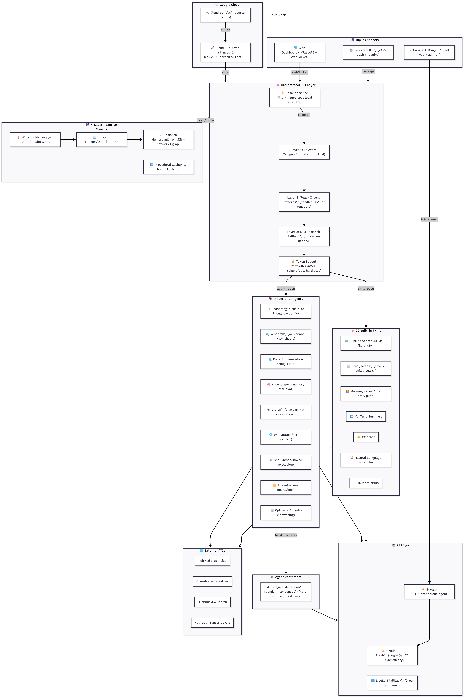

<div align="center">

# ◈ NEXUS AI

### Multi-Agent Personal Intelligence System
### Powered by Gemini 2.0 Flash · Google GenAI SDK

*Nine specialist agents. Twenty-tree skills. One physical therapy student's AI — built to go beyond the text box.*

[](https://python.org)
[](https://fastapi.tiangolo.com)
[](https://ai.google.dev)
[](https://ai.google.dev/gemini-api/docs)
[](https://google.github.io/adk-docs/)
[](https://cloud.google.com/run)
[](LICENSE)
[](https://geminiliveagentchallenge.devpost.com)

</div>

---

## 🎬 Demo Video

> ▶ **[Watch Demo (< 4 min)](https://youtu.be/TODO)** — Anatomy image analysis · PubMed search · Real-time agent reasoning · Multimodal output

## 🌐 Live Demo

> 🚀 **[nexus-ai-758633716956.asia-east1.run.app](https://nexus-ai-758633716956.asia-east1.run.app)** — Deployed on Google Cloud Run

---

## Beyond the Text Box

I'm a physical therapy student. Clinical information doesn't arrive as plain text — it comes as:

- **Anatomy diagrams** in textbooks I need explained instantly
- **Peer-reviewed papers** buried in PubMed, not Google
- **Clinical notes** organized by subject (anatomy, orthopedics, neurology…)
- **Reminders and schedules** that need to fire even when I'm away from my desk

I built Nexus AI to handle all of it — powered by **Gemini 2.0 Flash** via **Google GenAI SDK**, going beyond text with multimodal vision, structured output, and real-time multi-channel delivery.

---

## Screenshots

<table>
<tr>
<td align="center" width="50%">

**主控台 (Dashboard)**

*Real-time system status — 9 agents online, 23 skills loaded, token budget at 100%, Web UI and Telegram both live. Daily brief panel with quick-access shortcuts.*

</td>
<td align="center" width="50%">

**對話 + Analysis Log**

*Chat interface with live Analysis Log showing internal agent routing — query "查旋轉肌撕裂論文" matched academic_search skill. PubMed returns 9,411 results; top 8 shown with authors, journal, year, and direct links.*

</td>
</tr>
<tr>
<td align="center" width="50%">

**技能演化圖 (D3.js Skill Graph)**

*D3.js force-directed graph visualizing all 22 skills organized by category (學術, 生產力, 工具, 資訊, 系統) radiating from the NEXUS CORE hub. Each node is a live, callable skill.*

</td>
<td align="center" width="50%">

**Telegram Vision Agent**

*Send an anatomy diagram photo via Telegram → Gemini Vision analyzes every structure and returns a structured description in Traditional Chinese with clinical functions.*

</td>
</tr>
</table>

---

## Multimodal: How Gemini Powers Every Layer

| Input | Gemini Capability | Output |
|-------|------------------|--------|
| Anatomy diagram photo (Telegram) | Vision API — `gemini-2.0-flash` | Structured Chinese description of anatomical structures + clinical functions |
| Chinese clinical query (text) | Multimodal understanding + generation | Routed response in Traditional Chinese with markdown formatting |
| PubMed paper (text + metadata) | Synthesis + summarization | Structured citation card with PMID, authors, relevance |
| Natural language schedule (text) | Intent extraction | Parsed cron expression → autonomous execution |

All calls go through **Google GenAI SDK** (`google-generativeai`), with Groq Llama as offline fallback.

---

## System Architecture



<details>
<summary>Text diagram</summary>

```
┌─────────────────────────────────────────────────────────────┐
│                      INTERFACES                              │
│   Web UI (WebSocket)  ·  Telegram Bot  ·  REST API          │
└────────────────────────────┬────────────────────────────────┘
                             │
┌────────────────────────────▼────────────────────────────────┐
│                TOKEN BUDGET CONTROLLER                       │
│        50,000 tokens/day hard cap · auto-reset at midnight  │
└────────────────────────────┬────────────────────────────────┘
                             │
┌────────────────────────────▼────────────────────────────────┐
│                      ORCHESTRATOR                            │
│   Intent detection → Agent scoring → Memory recall → Route  │
└──────────────┬──────────────────────────────┬──────────────┘
               │                              │
┌──────────────▼──────────────┐  ┌────────────▼──────────────┐
│     SPECIALIST AGENTS (9)   │  │    SKILL ENGINE (22)       │
│                             │  │                            │
│  Reasoning   · chain-of-   │  │  academic_search  weather  │
│               thought COT   │  │  translator       news     │
│  Research    · web + synth  │  │  calculator       stock    │
│  Vision      · Gemini vision│  │  currency         github   │
│  Coder       · code gen     │  │  reminder         diary    │
│  Knowledge   · fact recall  │  │  auto_schedule    pomodoro │
│  File        · local files  │  │  study_notes      pdf_read │
│  Web         · URL fetch    │  │  youtube_summary  text_tool│
│  Shell       · sandbox exec │  │  web_search       memory   │
│  Optimizer   · self-optim.  │  │  skill_architect  + more   │
└─────────────────────────────┘  └────────────────────────────┘
               │
┌──────────────▼──────────────────────────────────────────────┐
│                  4-LAYER MEMORY SYSTEM                       │
│                                                              │
│  ① Working Memory    7 attention slots, LRU eviction        │
│  ② Episodic Memory   SQLite FTS5, full-text search          │
│  ③ Semantic Memory   ChromaDB + sentence-transformers        │
│  ④ Procedural Cache  response dedup, 1hr TTL                │
└──────────────┬──────────────────────────────────────────────┘
               │
┌──────────────▼──────────────────────────────────────────────┐
│            LLM PROVIDER  (Google GenAI SDK)                  │
│  Primary : Gemini 2.0 Flash  (gemini-2.0-flash)             │
│  Fallback: Groq Llama 3.3 70B                               │
└──────────────────────────────────────────────────────────────┘
               │
┌──────────────▼──────────────────────────────────────────────┐
│            DEPLOYMENT                                        │
│  Google Cloud Run (production) · Local uvicorn (dev)        │
└─────────────────────────────────────────────────────────────┘
```

</details>

---

## Key Features

### 🔮 Gemini 2.0 Flash — Core Intelligence
Every agent calls Gemini 2.0 Flash via **Google GenAI SDK**. The Vision agent uses Gemini's multimodal API to analyze images sent via Telegram — anatomy diagrams, X-rays, clinical figures — and returns structured descriptions in Traditional Chinese.

```python
# Example: user sends anatomy photo via Telegram
# Vision agent routes to Gemini multimodal endpoint
# Returns: structured anatomical description in zh-TW
```

### 🧠 Multi-Agent Orchestration — Zero Manual Routing
Every request is scored against all 9 agents simultaneously. The highest-confidence agent handles it automatically.

```python
# Example: 「幫我找前十字韌帶復健的相關論文」
# Orchestrator scores all 9 agents
# Routes to: academic_search (score=0.92)
# Expands: 「前十字韌帶」→「Anterior Cruciate Ligament[MeSH]」
# Queries: PubMed E-utilities API directly
```

### 🔬 PT-Domain Academic Search
Three real databases — **PubMed** (NCBI E-utilities), **Semantic Scholar**, **OpenAlex** — with automatic MeSH term expansion for physical therapy vocabulary. Returns real PMIDs, authors, journals, direct links.

### 📝 Persistent Study Notes
Notes organized by PT subject (解剖學, 骨科, 神經, 心肺…). Stored in SQLite, searchable by keyword, reviewable by subject. LLM-powered quiz generation from saved notes.

### 📅 Autonomous Scheduler
Set recurring tasks in natural language:
- `「每天早上6點 生成晨報」` — daily at 6AM
- `「每週一三五早上7點 英文單字練習」` — Mon/Wed/Fri

Executes automatically and sends Telegram push notifications.

### 💡 Three-Layer NLP Routing
1. **Trigger keywords** — instant match, no Gemini call needed
2. **Intent patterns** — regex covers 80%+ of requests
3. **Gemini fallback** — only when patterns don't match

### 🛡️ Responsible AI by Design
- Hard daily token budget (never exceeds free tier)
- Filesystem sandbox (agents limited to `data/` and `workspace/`)
- SSRF protection (internal IPs, cloud metadata endpoints blocked)
- Rate limiter (30 req/min per IP)
- Local-only memory (no data leaves device except the Gemini API call)

---

## Interface Comparison

| Feature | Web UI (`/`) | Dashboard (`/dashboard`) | Telegram |
|---------|-------------|--------------------------|----------|
| Real-time chat | ✅ WebSocket | ✅ Integrated tab | ✅ |
| Analysis log | ✅ | ✅ | ❌ |
| Agent status | ✅ | ✅ | ❌ |
| Skill graph | ❌ | ✅ D3.js | ❌ |
| Schedule view | ❌ | ✅ Daily brief | ❌ |
| Image input | ❌ | ❌ | ✅ Gemini vision |
| File upload | ❌ | ❌ | ✅ |
| Mobile-friendly | ✅ | ✅ | ✅ native |

---

## Tech Stack

| Layer | Technology |
|-------|-----------|
| LLM | **Gemini 2.0 Flash** (Google GenAI SDK) · Groq Llama 3.3 70B fallback |
| Agent Framework | **Google ADK** (Agent Development Kit) — standalone agent entry point |
| Backend | Python 3.11 · FastAPI · asyncio |
| Memory | SQLite FTS5 · ChromaDB · NetworkX |
| Frontend | Vanilla JS · WebSocket · D3.js v7 · Orbitron/Rajdhani fonts |
| Bot | python-telegram-bot |
| Deployment | **Google Cloud Run** (min-instances=1, max-instances=1) |
| Security | Custom SSRF filter · Rate limiter · Token budget controller |

---

## Google Cloud Deployment

**Live:** [https://nexus-ai-758633716956.asia-east1.run.app](https://nexus-ai-758633716956.asia-east1.run.app)

```bash
# Build and deploy to Cloud Run (recommended)
./startup.sh

# Or manually:
gcloud run deploy nexus-ai \
  --source . \
  --region asia-east1 \
  --allow-unauthenticated \
  --memory 1Gi \
  --min-instances 1 \
  --max-instances 1 \
  --update-env-vars GEMINI_API_KEY=your_key
```

Or use the included `Dockerfile` for local container builds.

---

## Quick Start (Local)

```bash
# 1. Clone
git clone https://github.com/xushuowen/nexus-ai.git
cd nexus-ai

# 2. Install dependencies
pip install -r requirements.txt

# 3. Configure
cp .env.example .env
# Edit .env — only GEMINI_API_KEY is required

# 4. Run
cd nexus
python run.py
# Web UI:    http://localhost:8001
# Dashboard: http://localhost:8001/dashboard
```

## Environment Variables

| Variable | Required | Description |
|----------|----------|-------------|
| `GEMINI_API_KEY` | **Yes** | Google AI Studio — free at [aistudio.google.com](https://aistudio.google.com) |
| `TELEGRAM_BOT_TOKEN` | Optional | From @BotFather — enables Telegram vision agent |
| `TELEGRAM_OWNER_ID` | Optional | Your Telegram user ID (for push notifications) |
| `GROQ_API_KEY` | Optional | Groq free tier — offline fallback LLM |
| `GITHUB_TOKEN` | Optional | Increases GitHub API rate limit 60→5000 req/hr |

---

## Test Instructions for Judges

Start the server, open `http://localhost:8001/dashboard`, click the **「對話」** tab.

| # | Input | What it demonstrates |
|---|-------|---------------------|
| 1 | `幫我找前十字韌帶復健的相關論文` | Gemini routes → PubMed MeSH expansion |
| 2 | `台北天氣` | Skill trigger (no Gemini needed) |
| 3 | `幫我翻譯：Physical therapy improves quality of life` | Gemini translation |
| 4 | `計算 sqrt(144) + 3^4` | Safe AST calculator (no eval()) |
| 5 | `1000 美金等於多少台幣` | Real-time currency exchange |
| 6 | `github trending python` | GitHub API trending repos |
| 7 | `筆記 解剖學 旋轉肌群包括棘上肌棘下肌小圓肌肩胛下肌` | Study notes → SQLite insert |
| 8 | **Telegram**: Send anatomy diagram photo | Gemini vision → structured analysis |

All text tests work with only `GEMINI_API_KEY`. Test #8 requires `TELEGRAM_BOT_TOKEN`.

---

## Project Structure

```
adk_agent/                     # Google ADK standalone agent ★
├── agent.py                   # root_agent with web/PubMed/calc/weather tools
└── __init__.py
nexus/
├── main.py                    # FastAPI entry point, WebSocket, lifespan
├── config.yaml                # Model routing, budget, memory config
├── core/
│   ├── orchestrator.py        # Central routing engine (9 agents + 22 skills)
│   ├── budget.py              # Token budget enforcement
│   ├── three_stream.py        # Streaming event system
│   └── schedule_runner.py     # Async cron scheduler
├── agents/                    # 9 specialist agents
│   ├── reasoning_agent.py     # Chain-of-thought multi-step reasoning
│   ├── research_agent.py      # Web search + synthesis
│   ├── vision_agent.py        # Gemini multimodal image analysis ★
│   ├── coder_agent.py         # Code generation + sandboxed execution
│   └── ...
├── skills/builtin/            # 22 built-in skills
│   ├── academic_search.py     # PubMed + Semantic Scholar + OpenAlex
│   ├── study_notes.py         # PT subject notes (SQLite)
│   ├── auto_schedule_skill.py # Natural language scheduling
│   ├── calculator.py          # Safe AST evaluator
│   ├── currency.py            # Real-time exchange rates
│   └── ...
├── providers/
│   └── llm_provider.py        # Google GenAI SDK + LiteLLM wrapper ★
├── memory/
│   └── hybrid_store.py        # 4-layer memory orchestration
├── gateway/
│   ├── telegram_channel.py    # Telegram bot (text + image + file)
│   └── api_channel.py         # REST API gateway
└── security/
    ├── url_filter.py          # SSRF protection
    ├── auth.py                # API key authentication
    └── rate_limiter.py        # Per-IP rate limiting
```

---

## Responsible AI

| Safeguard | Implementation |
|-----------|---------------|
| Token budget | Hard daily cap (50,000 tokens), resets at midnight, blocks on exhaustion |
| Filesystem sandbox | Agents can only read/write `data/` and `workspace/` |
| SSRF protection | Blocks `localhost`, `169.254.x.x`, `10.x`, private ranges, cloud metadata |
| Rate limiting | 30 requests/minute per client IP |
| Input sanitization | Shell agent blocks dangerous args (`-c`, `eval`, `exec`, `rm -rf`) |
| Data privacy | All memory stored on-device; only the Gemini API call leaves the machine |
| Transparent reasoning | Every response shows which agent handled it and the routing trace |

---

## Competition

<div align="center">

**Gemini Live Agent Challenge 2026**
Track: **Live Agents** · Google Agent Development Kit (ADK)

Nexus AI demonstrates production-grade multi-agent orchestration powered by **Gemini 2.0 Flash**, **Google GenAI SDK**, and **Google ADK**. It goes beyond the text box with real-time multimodal vision (anatomy diagrams → structured clinical descriptions), 9 specialist agents, 22 skills, a 4-layer memory system, and a standalone ADK agent — all built for real daily use.

[🔗 geminiliveagentchallenge.devpost.com](https://geminiliveagentchallenge.devpost.com)

</div>

---

## License

MIT — free to use, study, and build upon.
