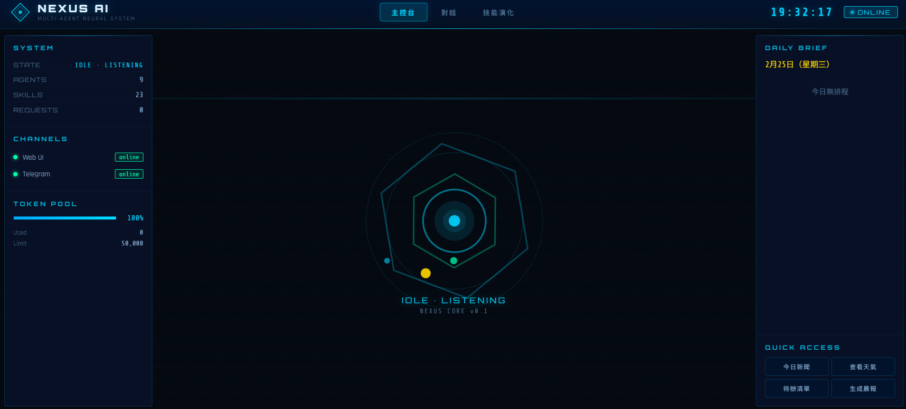
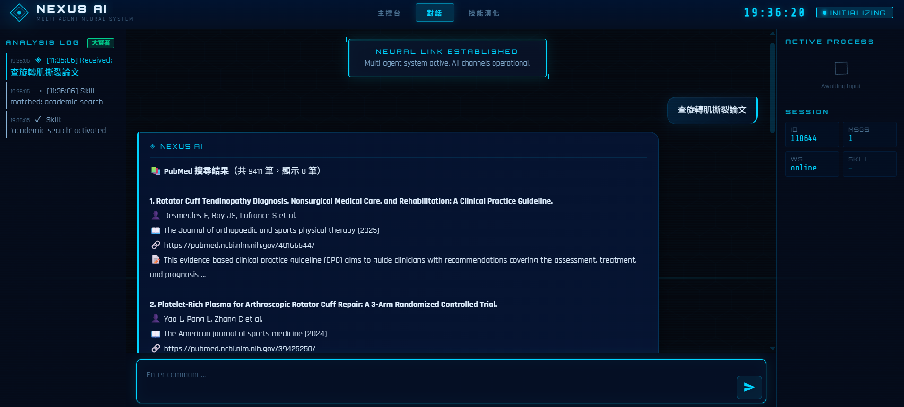
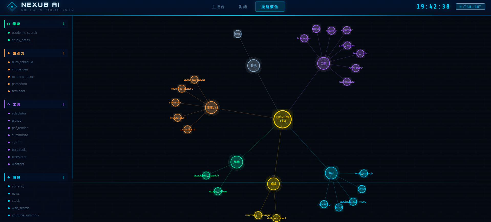

<div align="center">

# ◈ NEXUS AI

### Multi-Agent Personal Intelligence System
### Powered by Gemini 2.5 Flash · Gemini Live API · Google ADK

*Nine specialist agents. Twenty-four skills. Real-time voice. One physical therapy student's AI — built to go beyond the text box.*

[](https://python.org)
[](https://fastapi.tiangolo.com)
[](https://ai.google.dev)
[](https://ai.google.dev/gemini-api/docs/live)
[](https://ai.google.dev/gemini-api/docs)
[](https://google.github.io/adk-docs/)
[](https://cloud.google.com/run)
[](LICENSE)
[](https://geminiliveagentchallenge.devpost.com)

</div>

---

## 🎬 Demo Video

> ▶ **[Watch Demo (< 4 min)](https://youtu.be/TODO)** — Real-time voice · PubMed search · Anatomy analysis · Multi-agent routing

## 🌐 Live Demo

> 🚀 **[nexus-ai-nc4iieaq3q-de.a.run.app](https://nexus-ai-nc4iieaq3q-de.a.run.app)** — Deployed on Google Cloud Run (asia-east1)
>
> 🎤 **[/voice](https://nexus-ai-nc4iieaq3q-de.a.run.app/voice)** — Real-time voice interface (Gemini Live API)

---

## Beyond the Text Box

I'm a physical therapy student. Clinical information doesn't arrive as plain text — it comes as:

- **Anatomy diagrams** in textbooks I need explained instantly
- **Peer-reviewed papers** buried in PubMed, not Google
- **Clinical notes** organized by subject (anatomy, orthopedics, neurology…)
- **Voice questions** during study — hands on textbook, can't type

I built Nexus AI to handle all of it — powered by **Gemini 2.5 Flash** + **Gemini Live API** via **Google GenAI SDK**, going beyond text with real-time voice, multimodal vision, structured output, and multi-channel delivery.

---

## Screenshots

<table>
<tr>
<td align="center" width="50%">

**🎤 Voice Interface**

*Real-time voice chat powered by Gemini Live API (`gemini-2.5-flash-native-audio-latest`). Hold mic → speak → hear AI respond. Live transcript shown alongside audio. Function calling: weather, search, calculator mid-conversation.*

</td>
<td align="center" width="50%">

**主控台 (Dashboard)**

*Real-time system status — 9 agents online, 24 skills loaded, token budget at 100%, Web UI + Voice + Telegram all live. Daily brief panel with quick-access shortcuts.*

</td>
</tr>
<tr>
<td align="center" width="50%">

**對話 + Analysis Log**

*Chat interface with live Analysis Log showing internal agent routing — query "查旋轉肌撕裂論文" matched academic_search skill. PubMed returns 9,411 results; top 8 shown with authors, journal, year, and direct links.*

</td>
<td align="center" width="50%">

**技能演化圖 (D3.js Skill Graph)**

*D3.js force-directed graph visualizing all 24 skills organized by category (學術, 生產力, 工具, 資訊, 系統) radiating from the NEXUS CORE hub. Each node is a live, callable skill.*

</td>
</tr>
</table>

---

## How Gemini Powers Every Layer

| Input | Gemini Capability | Output |
|-------|------------------|--------|
| 🎤 Voice (microphone) | **Live API** `gemini-2.5-flash-native-audio-latest` | Real-time speech → function calls → spoken response |
| Anatomy diagram photo (Telegram) | Vision API `gemini-2.5-flash` | Structured Chinese description + clinical functions |
| Chinese clinical query (text) | Multimodal understanding + generation | Routed response in Traditional Chinese with markdown |
| PubMed paper (text + metadata) | Synthesis + summarization | Structured citation card with PMID, authors, relevance |
| Natural language schedule (text) | Intent extraction | Parsed cron expression → autonomous execution |

All calls go through **Google GenAI SDK** (`google-genai`), with Groq Llama as offline fallback.

---

## System Architecture

<details>
<summary>Text diagram (click to expand)</summary>

```
┌─────────────────────────────────────────────────────────────────┐
│                        INTERFACES                                │
│  🎤 Voice UI (/voice)  ·  Web UI (/)  ·  Telegram  ·  REST API  │
└──────────────┬──────────────────────────────────────────────────┘
               │
┌──────────────▼──────────────────────────────────────────────────┐
│          GEMINI LIVE API  (Voice Channel)                        │
│  Browser Mic → 16kHz PCM → WebSocket /ws/voice                  │
│  gemini-2.5-flash-native-audio-latest (bidirectional stream)    │
│  Tool calling: weather · web_search · calculator                │
│  Output: 24kHz PCM audio + transcript                           │
└──────────────┬──────────────────────────────────────────────────┘
               │
┌──────────────▼──────────────────────────────────────────────────┐
│               TOKEN BUDGET CONTROLLER                            │
│       50,000 tokens/day hard cap · auto-reset at midnight        │
└──────────────┬──────────────────────────────────────────────────┘
               │
┌──────────────▼──────────────────────────────────────────────────┐
│                     ORCHESTRATOR                                 │
│   Keyword → Intent Pattern → Agent Score → Memory recall        │
└──────────────┬──────────────────────────┬───────────────────────┘
               │                          │
┌──────────────▼────────────┐  ┌──────────▼────────────────────────┐
│   SPECIALIST AGENTS (9)   │  │     SKILL ENGINE (24)              │
│                           │  │                                    │
│  Reasoning  · COT+verify  │  │  academic_search  weather          │
│  Research   · web+synth   │  │  translator       news             │
│  Vision     · Gemini vis. │  │  calculator       stock            │
│  Coder      · code+exec   │  │  currency         github           │
│  Knowledge  · fact recall │  │  reminder         diary            │
│  File       · local files │  │  auto_schedule    pomodoro         │
│  Web        · URL fetch   │  │  study_notes      pdf_reader       │
│  Shell      · sandbox     │  │  youtube_summary  text_tools       │
│  Optimizer  · self-optim. │  │  web_search       memory_manager   │
└───────────────────────────┘  │  skill_architect  image_gen        │
                               │  summarize        calendar         │
                               └────────────────────────────────────┘
               │
┌──────────────▼──────────────────────────────────────────────────┐
│                  5-LAYER MEMORY SYSTEM                           │
│  ① Working Memory    7 attention slots, LRU eviction            │
│  ② Episodic Memory   SQLite FTS5, full-text search              │
│  ③ Semantic Memory   ChromaDB vector search                     │
│  ④ Procedural Cache  response dedup, 1hr TTL                   │
│  ⑤ PyramidMemory     daily→monthly→yearly LLM compression       │
└──────────────┬──────────────────────────────────────────────────┘
               │
┌──────────────▼──────────────────────────────────────────────────┐
│           LLM PROVIDER  (Google GenAI SDK)                       │
│  Text/Vision : Gemini 2.5 Flash  (gemini-2.5-flash)             │
│  Voice       : gemini-2.5-flash-native-audio-latest             │
│  ADK Agent   : gemini-2.5-flash  (adk_agent/)                   │
│  Fallback    : Groq Llama 3.3 70B                               │
└──────────────────────────────────────────────────────────────────┘
               │
┌──────────────▼──────────────────────────────────────────────────┐
│              DEPLOYMENT                                          │
│  Google Cloud Run (asia-east1) · Local uvicorn (dev)            │
└──────────────────────────────────────────────────────────────────┘
```

</details>

---

## Key Features

### 🎤 Gemini Live API — Real-Time Voice Interface

Nexus AI goes beyond text with a **full-duplex voice interface** powered by `gemini-2.5-flash-native-audio-latest`.

- **Hold to speak** → browser captures 16kHz PCM → WebSocket `/ws/voice` → **Gemini Live API**
- Gemini responds with natural speech streamed back in real time (24kHz PCM)
- **Live function calling** mid-conversation: weather, web search, calculator — no interruption
- Real-time transcript displayed alongside audio playback
- Text input also supported for hybrid voice+text sessions

```
User speaks  →  AudioWorklet 16kHz PCM  →  base64 WebSocket chunks
             →  FastAPI /ws/voice
             →  client.aio.live.connect("gemini-2.5-flash-native-audio-latest")
             →  Gemini Live API (bidirectional audio stream)
             →  Tool call detected  →  execute get_weather() / search_web()
             →  send_tool_response()  →  continue streaming
             →  24kHz PCM chunks  →  browser AudioContext plays response
```

Navigate to `/voice` to try it live.

### 🔮 Gemini 2.5 Flash — Core Intelligence

Every agent and skill routes through **Gemini 2.5 Flash** via **Google GenAI SDK**. The Vision agent uses Gemini's multimodal API to analyze anatomy diagrams, X-rays, and clinical figures sent via Telegram — returning structured descriptions in Traditional Chinese.

### 🤖 Google ADK — Standalone Agent

A fully independent **Google Agent Development Kit** agent (`adk_agent/`) with 4 tools:

```bash
adk web adk_agent   # browser UI with built-in voice
adk run adk_agent   # CLI interface
```

Tools: `search_web` · `search_medical_papers` (PubMed) · `compute` · `get_weather`

### 🧠 Multi-Agent Orchestration — Zero Manual Routing

Every request is scored against all 9 agents simultaneously. The highest-confidence agent handles it automatically — no commands, no mode switching.

```
Input: 「幫我找前十字韌帶復健的相關論文」

Orchestrator scores all 9 agents:
  academic_search skill  →  0.92  ← winner
  research_agent         →  0.71
  knowledge_agent        →  0.34

Routes to: academic_search
Expands: 「前十字韌帶」 → 「Anterior Cruciate Ligament[MeSH]」
Queries: PubMed E-utilities API
Returns: 8 papers with PMID, authors, journals, direct links
```

### 🔬 PT-Domain Academic Search

Three real databases — **PubMed** (NCBI E-utilities), **Semantic Scholar**, **OpenAlex** — with automatic MeSH term expansion for 50+ physical therapy terms. Returns real PMIDs, authors, journals, direct links. Results saveable to study notes.

### 🧠 5-Layer Memory + PyramidMemory

```
Working Memory   →  7-slot attention buffer (LRU eviction)
Episodic         →  SQLite FTS5 full-text search
Semantic         →  ChromaDB vector similarity
Procedural       →  response cache (1hr TTL)
PyramidMemory    →  LLM compresses daily → monthly → yearly summaries
                    Long-term context injected into every conversation
```

### 📅 Autonomous Scheduler

Set tasks in natural language — executes and pushes Telegram notifications automatically:

```
「每天早上6點 生成晨報」        →  daily 06:00
「每週一三五早上7點 英文練習」  →  Mon/Wed/Fri 07:00
```

### 🛡️ Responsible AI by Design

- Hard daily token budget (50,000 tokens) — never exceeds free tier
- Filesystem sandbox — agents limited to `data/` and `workspace/`
- SSRF protection — blocks internal IPs, cloud metadata endpoints
- Rate limiter — 30 req/min per IP
- Code execution sandbox — blocks dangerous imports, 5-second timeout

---

## Interface Comparison

| Feature | 🎤 Voice (`/voice`) | Web UI (`/`) | Dashboard (`/dashboard`) | Telegram |
|---------|---------------------|-------------|--------------------------|----------|
| Real-time audio | ✅ bidirectional | ❌ | ❌ | ❌ |
| Text chat | ✅ hybrid | ✅ WebSocket | ✅ integrated | ✅ |
| Function calling | ✅ weather/search/calc | ✅ all 24 skills | ✅ all 24 skills | ✅ |
| Live transcript | ✅ | ✅ analysis log | ✅ | ❌ |
| Image input | ❌ | ✅ upload | ❌ | ✅ Gemini Vision |
| Skill graph | ❌ | ❌ | ✅ D3.js | ❌ |
| Schedule view | ❌ | ❌ | ✅ daily brief | ❌ |
| Mobile-friendly | ✅ | ✅ | ✅ | ✅ native |

---

## Tech Stack

| Layer | Technology |
|-------|-----------|
| Voice LLM | **Gemini 2.5 Flash Native Audio** (`gemini-2.5-flash-native-audio-latest`) |
| Text/Vision LLM | **Gemini 2.5 Flash** via Google GenAI SDK · Groq Llama 3.3 70B fallback |
| Agent Framework | **Google ADK 1.26** (Agent Development Kit) |
| Voice Protocol | WebSocket `/ws/voice` · 16kHz PCM in · 24kHz PCM out · Function calling |
| Backend | Python 3.11 · FastAPI · asyncio |
| Memory | SQLite FTS5 · ChromaDB · NetworkX · PyramidMemory (5-layer) |
| Frontend | Vanilla JS · WebSocket · D3.js v7 · Orbitron/Rajdhani fonts |
| Bot | python-telegram-bot |
| Deployment | **Google Cloud Run** (asia-east1) · Docker · Cloud Build |
| Security | SSRF filter · Rate limiter · Token budget · Filesystem sandbox |

---

## Google Cloud Deployment

**Live:** [https://nexus-ai-nc4iieaq3q-de.a.run.app](https://nexus-ai-nc4iieaq3q-de.a.run.app)

```bash
# One-command deploy
bash deploy/deploy.sh YOUR_GCP_PROJECT_ID asia-east1

# Deploys to Cloud Run with:
# - Python 3.11-slim container
# - NEXUS_BRAIN_MODE=gemini (no Playwright on Cloud Run)
# - 2Gi memory, 2 vCPU
# - GCS bucket for file uploads
```

---

## Quick Start (Local)

```bash
# 1. Clone
git clone https://github.com/xushuowen/nexus-ai.git
cd nexus-ai

# 2. Install (local)
pip install -r requirements.txt

# 3. Configure
cp .env.example .env
# Edit .env — only GEMINI_API_KEY is required

# 4. Run
python -m uvicorn nexus.main:app --host 0.0.0.0 --port 8000

# Web UI:     http://localhost:8000
# Voice:      http://localhost:8000/voice      ← NEW
# Dashboard:  http://localhost:8000/dashboard

# Or run ADK agent standalone:
pip install google-adk
adk web adk_agent
```

## Environment Variables

| Variable | Required | Description |
|----------|----------|-------------|
| `GEMINI_API_KEY` | **Yes** | Google AI Studio — free at [aistudio.google.com](https://aistudio.google.com) |
| `TELEGRAM_BOT_TOKEN` | Optional | From @BotFather — enables Telegram vision agent |
| `TELEGRAM_CHAT_ID` | Optional | Your Telegram chat ID (for push notifications) |
| `GROQ_API_KEY` | Optional | Groq free tier — offline fallback LLM |
| `GITHUB_TOKEN` | Optional | Increases GitHub API rate limit 60→5000 req/hr |
| `NEXUS_BRAIN_MODE` | Optional | `gemini` (API) or `gemini_web` (browser, local only) |

---

## Test Instructions for Judges

### 🎤 Voice Interface

1. Open `https://nexus-ai-nc4iieaq3q-de.a.run.app/voice`
2. Allow microphone access
3. **Hold** the mic button and speak — release to send

| Voice Input | What it demonstrates |
|-------------|---------------------|
| 「台北現在幾度？」 | Live API → `get_weather()` tool call → real temperature |
| 「幫我搜尋旋轉肌撕裂」 | Live API → `search_web()` → spoken results |
| 「計算 144 的平方根」 | Live API → `compute()` → math answer |

### 💬 Text / Chat Interface

Open `https://nexus-ai-nc4iieaq3q-de.a.run.app/` or `/dashboard`:

| # | Input | What it demonstrates |
|---|-------|---------------------|
| 1 | `幫我找前十字韌帶復健的相關論文` | PubMed MeSH expansion → real papers |
| 2 | `台北天氣` | Skill trigger (no Gemini call) |
| 3 | `幫我翻譯：Physical therapy improves quality of life` | Gemini translation |
| 4 | `計算 sqrt(144) + 3^4` | Safe AST calculator |
| 5 | `1000 美金等於多少台幣` | Real-time currency exchange |
| 6 | `筆記 骨科 旋轉肌群包括棘上肌棘下肌小圓肌肩胛下肌` | Study notes → SQLite |
| 7 | `github trending python` | GitHub API |
| 8 | **Telegram**: send anatomy diagram photo | Gemini Vision → structured analysis |

All text tests work with only `GEMINI_API_KEY`. Voice requires microphone access. Test #8 requires `TELEGRAM_BOT_TOKEN`.

---

## Project Structure

```
adk_agent/                      # Google ADK standalone agent ★
├── agent.py                    # root_agent: web/PubMed/calc/weather tools
└── __init__.py
nexus/
├── main.py                     # FastAPI entry, lifespan, routes
├── config.yaml                 # Model routing, budget, memory config
├── core/
│   ├── orchestrator.py         # Central routing (9 agents + 24 skills)
│   ├── budget.py               # Token budget enforcement
│   ├── three_stream.py         # Streaming event system
│   ├── schedule_runner.py      # Async cron scheduler
│   └── notifications.py        # Desktop/Telegram push notifications
├── agents/                     # 9 specialist agents
│   ├── reasoning_agent.py      # Chain-of-thought + self-critique
│   ├── research_agent.py       # Web search + LLM synthesis
│   ├── vision_agent.py         # Gemini Vision (EasyOCR fallback)
│   ├── coder_agent.py          # Code gen + sandboxed execution
│   └── ...
├── skills/builtin/             # 24 built-in skills
│   ├── academic_search.py      # PubMed + Semantic Scholar + OpenAlex
│   ├── study_notes.py          # PT subject notes (SQLite)
│   ├── auto_schedule_skill.py  # Natural language scheduling
│   ├── calculator.py           # Safe eval (restricted scope)
│   ├── currency.py             # Real-time exchange rates
│   └── ...
├── providers/
│   ├── llm_provider.py         # Google GenAI SDK + LiteLLM ★
│   └── model_config.py         # Model routing + NEXUS_BRAIN_MODE
├── memory/
│   ├── hybrid_store.py         # 5-layer memory orchestration
│   └── pyramid_memory.py       # LLM-based long-term compression ★
├── gateway/
│   ├── voice_channel.py        # Gemini Live API WebSocket /ws/voice ★
│   ├── telegram_channel.py     # Telegram bot (text + image + file)
│   └── api_channel.py          # REST API gateway
├── security/
│   ├── url_filter.py           # SSRF protection
│   ├── auth.py                 # API key authentication
│   └── rate_limiter.py         # Per-IP rate limiting
└── deploy/
    ├── deploy.sh               # Automated Cloud Run deployment
    └── architecture.html       # Interactive architecture diagram
```

---

## Responsible AI

| Safeguard | Implementation |
|-----------|---------------|
| Token budget | Hard daily cap (50,000 tokens), resets midnight, blocks on exhaustion |
| Filesystem sandbox | Agents only read/write `data/` and `workspace/` |
| SSRF protection | Blocks `localhost`, `169.254.x.x`, `10.x`, cloud metadata |
| Rate limiting | 30 requests/minute per client IP |
| Input sanitization | Shell agent blocks dangerous args; code agent blocks `import os/sys` |
| Code timeout | Sandboxed Python execution has 5-second hard timeout |
| Data privacy | All memory stored on-device; only Gemini API calls leave machine |
| Transparent routing | Every response shows which agent handled it and routing trace |

---

## Competition

<div align="center">

**Gemini Live Agent Challenge 2026**
Track: **Live Agents** · Google Agent Development Kit (ADK)

Nexus AI demonstrates production-grade multi-agent orchestration powered by **Gemini 2.5 Flash**, **Gemini Live API**, **Google GenAI SDK**, and **Google ADK**. It goes beyond text with:

- 🎤 **Real-time bidirectional voice** (Gemini Live API, native audio)
- 🤖 **9 specialist agents** with automatic routing
- 🔧 **24 skills** covering search, memory, scheduling, vision, and more
- 🧠 **5-layer memory** including LLM-powered long-term compression
- 🔬 **PT-domain academic search** across PubMed, Semantic Scholar, OpenAlex
- ☁️ **Deployed on Google Cloud Run** (asia-east1)

[🔗 geminiliveagentchallenge.devpost.com](https://geminiliveagentchallenge.devpost.com)

</div>

---

## License

MIT — free to use, study, and build upon.
