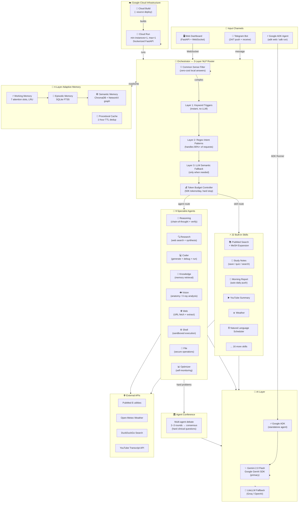

# Nexus AI — System Architecture

## Key Design Decisions

| Decision | Rationale |
|----------|-----------|
| **3-layer NLP routing** | 80%+ of requests handled without LLM call → saves tokens |
| **min-instances=1** | Telegram polling requires always-on instance |
| **max-instances=1** | Prevents Telegram polling conflicts across revisions |
| **Token Budget Controller** | Hard daily cap with atomic JSON state prevents runaway costs |
| **Agent Conference** | Multi-agent debate measurably improves complex clinical reasoning |
| **4-layer memory** | Fast cache-first lookup, only escalates to vector search on cache miss |
| **Google ADK** | Standalone agent entry point qualifying for Live Agents category |
